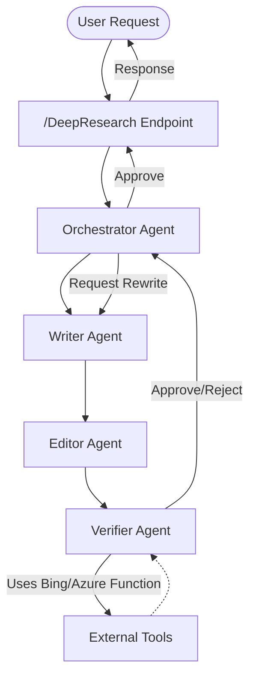

# FoundryAgent: Multi-Agent AI Service Demo

## Overview

FoundryAgent is a multi-agent, plugin-enabled AI orchestration service built with .NET Aspire, Azure AI, and Semantic Kernel. It demonstrates how to coordinate multiple specialized AI agents (Writer, Editor, Verifier, Orchestrator) to collaboratively generate, review, and fact-check content using both LLMs and external tools (including Azure Functions and Bing Search). The project is designed for extensibility, cloud-native deployment, and integration with modern AI workflows.

---

## Features

- **Multi-Agent Collaboration:** Writer, Editor, Verifier, and Orchestrator agents work in sequence to produce and validate articles.
- **Plugin/Tool Support:** Agents can use external tools such as Bing Search and Azure Functions for fact-checking and enrichment.
- **Semantic Kernel Integration:** Uses Microsoft.SemanticKernel for orchestration, chat history, and function calling.
- **Azure AI Integration:** Supports Azure OpenAI, Azure Functions, and Azure Storage for advanced scenarios.
- **Aspire Ready:** Designed for .NET Aspire with AppHost, ServiceDefaults, and Web front-end.
- **Extensible:** Easily add new agents, tools, or plugins.

---

## Project Structure

```
FoundryAgent.sln
FoundryAgent.ApiService/      # Main API and agent orchestration logic
  Agents/                    # Agent classes (Writer, Editor, Verifier, Orchestrator, etc.)
  Program.cs                 # API entry point and endpoint definitions
  ...
FoundryAgent.AppHost/        # Aspire AppHost for local/cloud orchestration
FoundryAgent.ServiceDefaults/# Shared service configuration
FoundryAgent.Web/            # (Optional) Web front-end
```

---

## Mermaid Flowchart



---

## Secret Management & Security

- **No secrets are hardcoded** in code or config files.
- All sensitive values (API keys, connection strings, etc.) are loaded from environment variables or configuration files.
- For local development, use `appsettings.Development.json` (never commit real secrets) or environment variables.
- For production (including Azure):
  - Use environment variables, or
  - Use Azure Key Vault and reference secrets in your configuration.
- `.gitignore` ensures no sensitive files are committed.

---

## Step-by-Step: Local Development Setup

1. **Clone the repository:**
   ```sh
   git clone <your-repo-url>
   cd AgentServiceDemo
   ```

2. **Configure secrets:**
   - Open `FoundryAgent.ApiService/appsettings.Development.json` and ensure no real secrets are present.
   - Set secrets as environment variables (Windows PowerShell example):
     ```powershell
     $env:AZURE_OPENAI_ENDPOINT = "https://your-openai-endpoint.azure.com/"
     $env:AZURE_OPENAI_API_KEY = "your-azure-openai-api-key"
     $env:PROJECT_CONNECTION_STRING = "your-local-connection-string"
     ```
   - Or, for Linux/macOS (bash/zsh):
     ```bash
     export AZURE_OPENAI_ENDPOINT="https://your-openai-endpoint.azure.com/"
     export AZURE_OPENAI_API_KEY="your-azure-openai-api-key"
     export PROJECT_CONNECTION_STRING="your-local-connection-string"
     ```
   - Or, for local-only testing, you may temporarily set placeholders in `appsettings.Development.json` (do not commit real values).

3. **Run the service:**
   ```sh
   dotnet build FoundryAgent.sln
   dotnet run --project FoundryAgent.ApiService/FoundryAgent.ApiService.csproj
   ```

4. **Access endpoints:**
   - Example: [https://localhost:7586/DeepResearch?input=write+a+product+description+about+a+jeans+skirt](https://localhost:7586/DeepResearch?input=write+a+product+description+about+a+jeans+skirt)

---

## Step-by-Step: Azure Deployment

1. **Provision Azure resources:**
   - Create an Azure App Service, Container App, or other compute resource.
   - (Recommended) Create an [Azure Key Vault](https://learn.microsoft.com/azure/key-vault/general/overview) for secret storage.

2. **Configure secrets in Azure:**
   - Set environment variables in your App Service/Container App for:
     - `AZURE_OPENAI_ENDPOINT`
     - `AZURE_OPENAI_API_KEY`
     - `PROJECT_CONNECTION_STRING`
   - Or, use Key Vault references in your configuration (see [Azure Key Vault integration](https://learn.microsoft.com/azure/app-service/app-service-key-vault-references)).

3. **Deploy the app:**
   - Use Azure DevOps, GitHub Actions, or `az webapp deploy`/`az containerapp update` as appropriate.
   - Ensure no secrets are present in any committed config files.

4. **Monitor and manage:**
   - Use Azure Portal to monitor logs, update secrets, and manage deployments.

---

## Security Checklist Before Committing/Deploying
- [x] No secrets in code or config files.
- [x] `.gitignore` covers sensitive files.
- [x] All secret access is via configuration/environment/Key Vault.
- [x] README and code comments clarify secret management.

---

## References
- [Microsoft: Secure application secrets](https://learn.microsoft.com/aspnet/core/security/app-secrets)
- [Azure Key Vault best practices](https://learn.microsoft.com/azure/key-vault/general/best-practices)
- [Environment variables in .NET](https://learn.microsoft.com/dotnet/core/extensions/configuration-providers#environment-variables-configuration-provider)

---

**For questions or issues, contact the project maintainer.**

---

## (Original instructions and advanced usage below)

# FoundryAgent: Multi-Agent AI Service Demo

## Overview

FoundryAgent is a multi-agent, plugin-enabled AI orchestration service built with .NET Aspire, Azure AI, and Semantic Kernel. It demonstrates how to coordinate multiple specialized AI agents (Writer, Editor, Verifier, Orchestrator) to collaboratively generate, review, and fact-check content using both LLMs and external tools (including Azure Functions and Bing Search). The project is designed for extensibility, cloud-native deployment, and integration with modern AI workflows.

---

## Features

- **Multi-Agent Collaboration:** Writer, Editor, Verifier, and Orchestrator agents work in sequence to produce and validate articles.
- **Plugin/Tool Support:** Agents can use external tools such as Bing Search and Azure Functions for fact-checking and enrichment.
- **Semantic Kernel Integration:** Uses Microsoft.SemanticKernel for orchestration, chat history, and function calling.
- **Azure AI Integration:** Supports Azure OpenAI, Azure Functions, and Azure Storage for advanced scenarios.
- **Aspire Ready:** Designed for .NET Aspire with AppHost, ServiceDefaults, and Web front-end.
- **Extensible:** Easily add new agents, tools, or plugins.

---

## Project Structure

```
FoundryAgent.sln
FoundryAgent.ApiService/      # Main API and agent orchestration logic
  Agents/                    # Agent classes (Writer, Editor, Verifier, Orchestrator, etc.)
  Program.cs                 # API entry point and endpoint definitions
  ...
FoundryAgent.AppHost/        # Aspire AppHost for local/cloud orchestration
FoundryAgent.ServiceDefaults/# Shared service configuration
FoundryAgent.Web/            # (Optional) Web front-end
```

---

## Mermaid Flowchart


---

## Step-by-Step: Run Locally

### Prerequisites
- [.NET 8 SDK](https://dotnet.microsoft.com/en-us/download/dotnet/8.0)
- [Node.js](https://nodejs.org/) (for MCP server tools)
- Azure Subscription (for Azure AI/OpenAI, Bing, Azure Functions, Storage)
- (Optional) Docker Desktop (for containerized Aspire runs)

### 1. Clone the Repository
```pwsh
git clone <your-repo-url>
cd FoundryAgent.AiServiceDemo
```

### 2. Set Up User Secrets (for local dev)
```pwsh
dotnet user-secrets init --project FoundryAgent.ApiService
# Set your Azure OpenAI, Bing, and Storage connection strings:
dotnet user-secrets set "AZURE_OPENAI_KEY" "<your-key>" --project FoundryAgent.ApiService
dotnet user-secrets set "AZURE_STORAGE_CONNECTION_STRING" "<your-storage-conn>" --project FoundryAgent.ApiService
# ...add other secrets as needed
```

### 3. Build the Solution
```pwsh
dotnet build FoundryAgent.sln
```

### 4. Run Locally (Aspire)
```pwsh
dotnet run --project FoundryAgent.AppHost
```
- The AppHost will start all services and show endpoints in the console.
- Access the API (e.g. `https://localhost:7586/DeepResearch?input=Write an article about Volvo AB`)

### 5. Test Endpoints
- `/DeepResearch?input=...` — Multi-agent article workflow
- `/solveandexplain?equation=...` — Math plugin demo
- `/SemanticKernel?request=...` — Direct LLM function call

---

## Step-by-Step: Deploy to Azure

### 1. Provision Azure Resources
- Azure OpenAI resource (with GPT-4o or similar model)
- Azure Storage Account (for Azure Function tool)
- Azure Function App (optional, for custom tools)
- Azure Container Apps or App Service (for API hosting)

### 2. Set Up Azure Environment Variables
- Set connection strings and API keys as environment variables or Azure App Config/Key Vault.

### 3. Publish the Solution
```pwsh
dotnet publish FoundryAgent.sln -c Release
```

### 4. Deploy to Azure
- Use Azure CLI, GitHub Actions, or Azure DevOps to deploy the published output to your chosen Azure service.
- Example for Azure App Service:
```pwsh
az webapp up --name <your-app-name> --resource-group <your-rg> --plan <your-plan> --location <your-location> --src-path ./FoundryAgent.ApiService/bin/Release/net8.0/publish
```

### 5. Configure Networking and Endpoints
- Ensure required ports are open
- Set up custom domains or API Management as needed

---

## Troubleshooting
- Check the logs in the terminal or Azure portal for errors
- Ensure all required Azure resources are provisioned and keys are correct
- Use the `/DeepResearch` endpoint to verify agent orchestration

---

## Contributing
Pull requests and issues are welcome! Please see [CONTRIBUTING.md](CONTRIBUTING.md) for guidelines.

---

## License
MIT License
